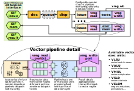

# Vicuna - a RISC-V Zve32x Vector Coprocessor

Vicuna is an open-source 32-bit integer vector coprocessor written in
SystemVerilog that implements version 1.0 of the
[RISC-V "V" Vector extension specification
](https://github.com/riscv/riscv-v-spec).
More precisely, Vicuna complies with the `Zve32x` extension, a variant of the
`V` extension aimed at embedded processors that do not require 64-bit elements
or floating-point support (see Sect. 18.2 of the specification for details).
As such, Vicuna supports vector element widths of 8, 16, and 32 bits and
implements all vector load and store, vector integer[^1], vector fixed-point,
vector integer reduction, vector mask, and vector permutation instructions.

[^1]: Currently, the vector integer divide instructions (i.e., `vdiv`, `vdivu`,
`vrem`, and `vremu`) are still missing.

Vicuna is a coprocessor and thus requires a main processor to function.  It
uses the OpenHW Group's [CORE-V eXtension Interface
](https://docs.openhwgroup.org/projects/openhw-group-core-v-xif/) as interface
to the main core.  Currently, a modified version of the [Ibex core
](https://github.com/lowRISC/ibex) or the [CV32E40X core
](https://github.com/openhwgroup/cv32e40x) serves as the main core.  Support
for further RISC-V CPUs is under development.

Vicuna is extensively configurable.  For instance, the width of the vector
registers, the number and layout of its execution pipelines and the width of
its memory interface are configurable. The following figure gives a high-level
overview of Vicuna.



Vicuna is under active development, and contributions are welcome!


## Documentation

A high-level user guide for using Vicuna can be
[read online at ReadTheDocs](http://vicuna.readthedocs.io/).


## Publication

If you use Vicuna in academic work, please cite
[our publication](https://doi.org/10.4230/LIPIcs.ECRTS.2021.1):

```
@InProceedings{platzer_et_al:LIPIcs.ECRTS.2021.1,
  author =  {Platzer, Michael and Puschner, Peter},
  title =   {{Vicuna: A Timing-Predictable RISC-V Vector Coprocessor for Scalable Parallel Computation}},
  booktitle =   {33rd Euromicro Conference on Real-Time Systems (ECRTS 2021)},
  pages =   {1:1--1:18},
  series =  {Leibniz International Proceedings in Informatics (LIPIcs)},
  ISBN =    {978-3-95977-192-4},
  ISSN =    {1868-8969},
  year =    {2021},
  volume =  {196},
  editor =  {Brandenburg, Bj\"{o}rn B.},
  publisher =   {Schloss Dagstuhl -- Leibniz-Zentrum f{\"u}r Informatik},
  address = {Dagstuhl, Germany},
  URL =     {https://drops.dagstuhl.de/opus/volltexte/2021/13932},
  URN =     {urn:nbn:de:0030-drops-139323},
  doi =     {10.4230/LIPIcs.ECRTS.2021.1},
  annote =  {Keywords: Real-time Systems, Vector Processors, RISC-V}
}
```


## Getting Started

This repository uses submodules.  After cloning the repository, run following
command in the top directory to initialize the submodules:
```
git submodule update --init --recursive
```

### Compiling programs

The [`sw/`](https://github.com/vproc/vicuna/tree/main/sw) subdirectory
contains utilities for generating programs that can be executed on Vicuna.


### Simulation

The [`sim/`](https://github.com/vproc/vicuna/tree/main/sim) subdirectory
contains scripts for simulating Vicuna with either
[Verilator](https://www.veripool.org/verilator/), xsim (the default simulator
in [Vivado](https://www.xilinx.com/products/design-tools/vivado.html)), or
Questasim.  For Verilator, version 4.210 or newer is required.


### Synthesis

The [`demo/`](https://github.com/vproc/vicuna/tree/main/demo) subdirectory
contains a minimalist demo design for Xilinx FPGAs.


## Configuration

Vicuna allows for extensive parametrization.  In particular, the width of
the vector registers, of the memory interface, and of the datapaths of the
functional units can be configured independently.


## License

Unless otherwise noted, everything in this repository is licensed under the
[Solderpad Hardware License v2.1](https://solderpad.org/licenses/SHL-2.1/), a
permissive free software license that is based on the Apache-2.0 license.

The Ibex core (included in this repository as a submodule) is licensed under
the Apache License, see [the Ibex repository](https://github.com/lowRISC/ibex)
for details.

The CV32E40X core (included in this repository as a submodule) is licensed
under the Solderpad Hardware License, see
[the CV32E40X repository](https://github.com/openhwgroup/cv32e40x) for details.
